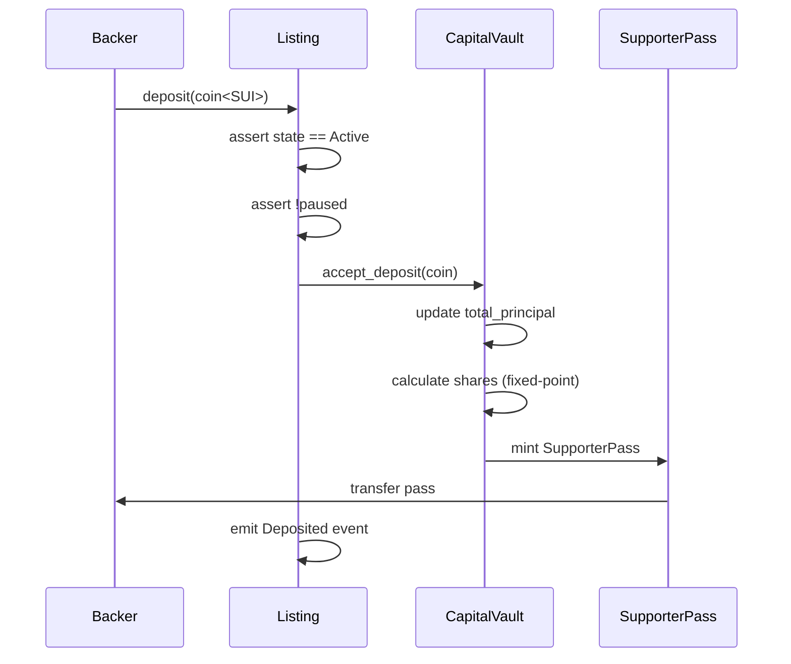
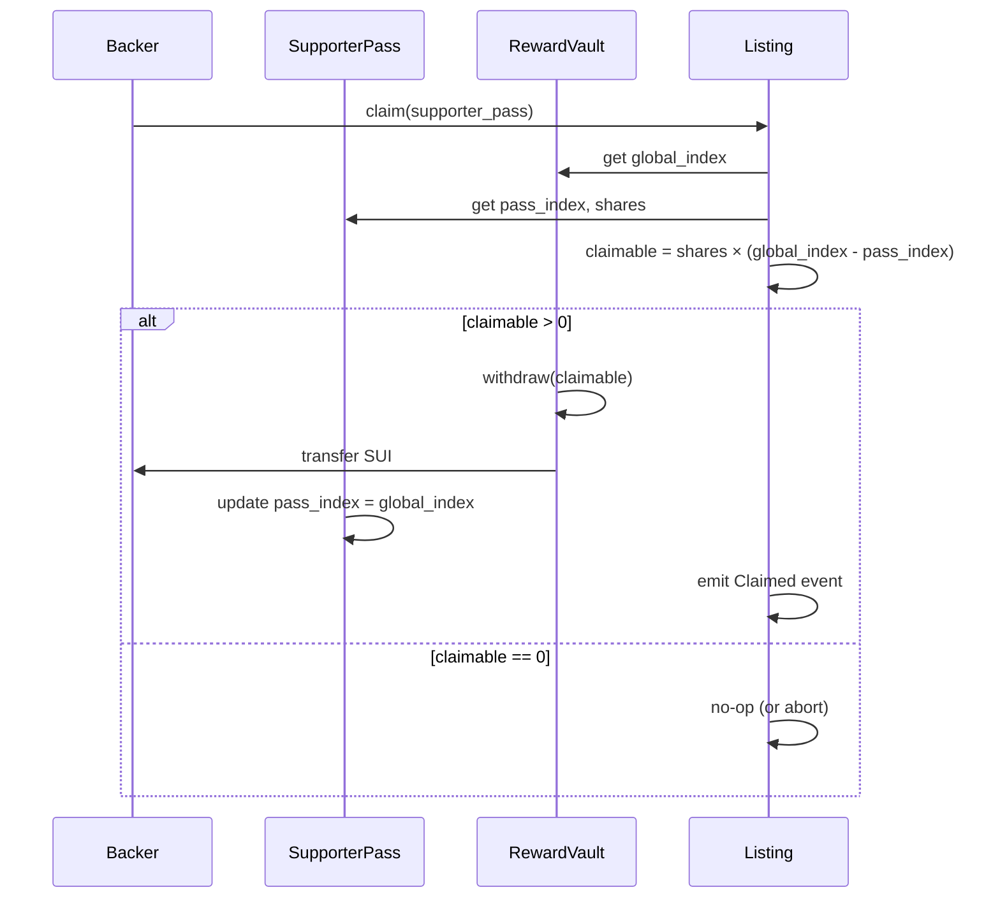
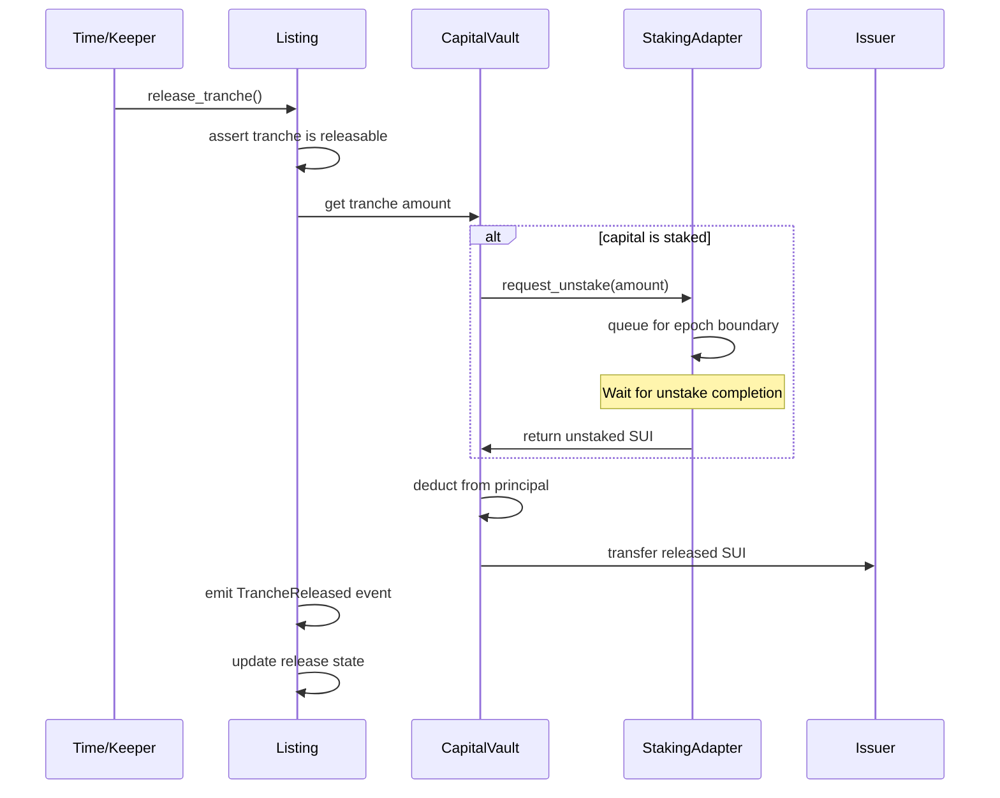
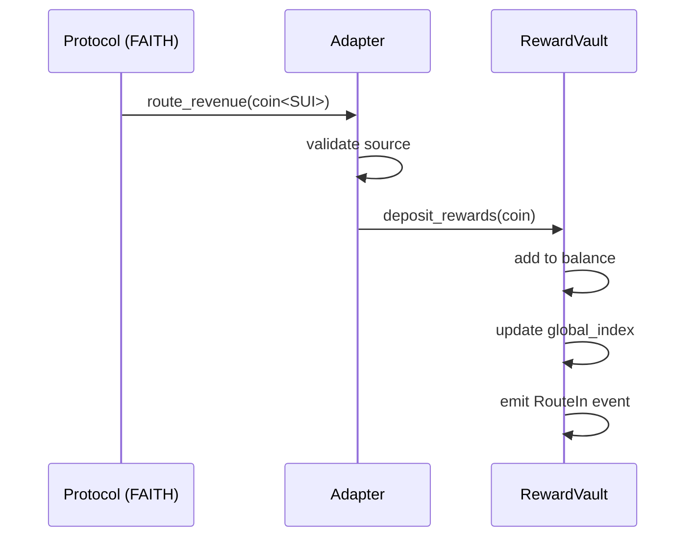

# Tide Protocol

A non-custodial, deterministic capital formation primitive for Sui.

Tide enables projects to raise capital **after product-market fit** without selling tokens, issuing equity, or introducing discretionary fund control. Capital is released on a fixed schedule while backers earn rewards from real protocol revenue and native staking yield.

## Why Tide?

| Traditional Funding | Tide |
|---------------------|----------|
| Token sales dilute holders | No token issuance |
| VCs want control | Non-custodial, on-chain logic only |
| Revenue sharing is discretionary | Enforceable on-chain routing |
| Complex legal structures | Deterministic smart contracts |
| Locked capital is idle | Native staking while locked |

## Core Concepts

### Actors

- **Backers** — Contribute SUI, receive a transferable economic position (SupporterPass), claim rewards
- **Issuer (Protocol Operator)** — Manages listing infrastructure, holds RouteCapability/ListingCap, routes protocol revenue
- **Release Recipient (Artist/Creator)** — Receives released capital on schedule from the CapitalVault
- **Listing Council** — 3-5 key multisig that gates listing creation, activation, and pause
- **TreasuryVault** — On-chain vault collecting protocol fees (1% raise fee + 20% of staking rewards), admin-gated withdrawals

> **Note:** The `issuer` and `release_recipient` are separate addresses. This allows the protocol operator (Tide) to manage adapter deployment and revenue routing while the artist receives their capital tranches directly.

### Key Objects

| Object | Type | Purpose |
|--------|------|---------|
| `Tide` | Shared | Global configuration, pause flag, version |
| `TreasuryVault` | Shared | Protocol fee collection (raise fees + staking splits) |
| `ListingRegistry` | Shared | Registry of all listings, council-gated creation |
| `CouncilCap` | Owned | Capability for council-gated operations |
| `Listing` | Shared | Capital raise parameters, lifecycle state, release schedule |
| `CapitalVault` | Shared | Holds contributed SUI, manages tranche releases |
| `RewardVault` | Shared | Holds rewards, maintains cumulative index for fair distribution |
| `StakingAdapter` | Shared | Manages native Sui staking for locked capital |
| `SupporterPass` | Owned (NFT) | Backer's transferable NFT with shares, claim cursor, pass number, original backer, and lifetime earnings |

## How It Works

### Capital Flow

```
┌─────────────────────────────────────────────────────────────────────────┐
│                             TIDE PROTOCOL                                │
├─────────────────────────────────────────────────────────────────────────┤
│                                                                          │
│   ┌──────────┐         ┌─────────────────┐         ┌──────────────┐    │
│   │  Backer  │ ──SUI──▶│  CapitalVault   │ ─────── │   Staking    │    │
│   └──────────┘         │  (locked SUI)   │ ◀────── │   Adapter    │    │
│        │               └────────┬────────┘         └──────────────┘    │
│        │                        │                         │             │
│        │ receives               │ releases on             │ yields      │
│        ▼                        │ schedule                ▼             │
│   ┌──────────────┐              │                  ┌─────────────┐     │
│   │ SupporterPass│              ▼                  │ RewardVault │     │
│   │  (NFT)       │         ┌─────────┐             │   (SUI)     │     │
│   └──────────────┘         │  Issuer │             └──────┬──────┘     │
│        │                   └─────────┘                    │             │
│        │                        │                         │             │
│        │                        │ routes revenue          │             │
│        │                        └─────────────────────────┘             │
│        │                                                  │             │
│        └─────────────────── claims ──────────────────────▶│             │
│                                                                          │
└─────────────────────────────────────────────────────────────────────────┘
```

### Reward Sources (v1)

1. **Protocol Revenue** — Fixed percentage routed from issuer (e.g., 10% of FAITH fees)
2. **Staking Yield** — Native Sui staking rewards on locked capital

## Deposit Flow



### Deposit Step-by-Step

1. **Backer calls `deposit()`** with SUI coin (minimum 1 SUI)
2. **Listing validates state** — Must be `Active`, not paused
3. **CapitalVault accepts deposit** — Validates minimum, adds to total principal
4. **Shares calculated** — `shares = deposit_amount * PRECISION / total_principal_at_deposit`
5. **SupporterPass minted** — NFT with:
   - Fixed shares (proportional claim on rewards)
   - Claim cursor at current index
   - Sequential pass number (e.g., "Backer #42")
   - Original backer address (provenance)
   - Lifetime claimed tracker (starts at 0)
6. **Pass transferred to backer** — Fully owned, transferable

## Withdrawal Flow (Reward Claims)



### Claim Step-by-Step

1. **Backer calls `claim()`** with their SupporterPass
2. **Fetch global reward index** from RewardVault
3. **Calculate claimable amount** — `shares × (global_index - pass_index)`
4. **Withdraw from RewardVault** — Deduct from vault balance
5. **Transfer SUI to backer** — Direct transfer
6. **Update pass cursor** — Set `pass_index = global_index` to prevent double-claim

### Batch Claiming (Multiple Passes)

Backers with multiple SupporterPasses can claim all rewards in a single transaction using `claim_many()`:

```move
/// Claim rewards from multiple passes at once
public fun claim_many(
    listing: &Listing,
    tide: &Tide,
    reward_vault: &mut RewardVault,
    passes: &mut vector<SupporterPass>,
    ctx: &mut TxContext,
): Coin<SUI>
```

**Benefits:**
- Single transaction for all passes = lower gas
- Automatically skips passes with nothing to claim (no errors)
- Returns merged coin with total claimed amount
- Individual `Claimed` events still emitted for each pass (for indexing)
- Summary `BatchClaimed` event emitted with totals

### Kiosk Support (Claim While Listed on Marketplace)

SupporterPass holders can claim rewards even when their pass is listed on a Kiosk-based NFT marketplace (BlueMove, Clutchy, etc.):

```move
/// Claim from a pass in your Kiosk
public fun claim_from_kiosk(
    listing: &Listing,
    tide: &Tide,
    reward_vault: &mut RewardVault,
    kiosk: &mut Kiosk,
    kiosk_cap: &KioskOwnerCap,
    pass_id: ID,
    ctx: &mut TxContext,
): Coin<SUI>

/// Batch claim from multiple passes in your Kiosk
public fun claim_many_from_kiosk(
    listing: &Listing,
    tide: &Tide,
    reward_vault: &mut RewardVault,
    kiosk: &mut Kiosk,
    kiosk_cap: &KioskOwnerCap,
    pass_ids: vector<ID>,
    ctx: &mut TxContext,
): Coin<SUI>
```

**How it works:**
1. Pass stays in Kiosk (listing not affected)
2. Owner uses their KioskOwnerCap to claim
3. Rewards withdrawn, pass returns to Kiosk
4. All in a single transaction

### Why This is Transfer-Safe

When a SupporterPass is transferred:
- New owner inherits the current `pass_index`
- They can only claim rewards accrued **after** the last claim
- Previous owner cannot claim again (no longer owns the pass)
- No coordination or approval needed

### SupporterPass NFT Fields

The SupporterPass is a dynamic NFT with economic and provenance data:

| Field | Type | Purpose | Mutable |
|-------|------|---------|---------|
| `pass_number` | u64 | Sequential backer number ("Backer #42") | ❌ |
| `original_backer` | address | Who first minted (provenance for resale) | ❌ |
| `shares` | u128 | Proportional claim on rewards | ❌ |
| `claim_index` | u128 | Last claimed reward index | ✅ (on claim) |
| `total_claimed` | u64 | Lifetime rewards claimed through this pass | ✅ (on claim) |
| `created_epoch` | u64 | Sui epoch when minted | ❌ |

**Secondary Market Benefits:**
- `pass_number` provides collectibility ("I was an early backer!")
- `original_backer` provides provenance (even after transfer)
- `total_claimed` shows earning history (dynamic, living NFT)

## Deterministic Capital Release

Capital is released on a **fixed, immutable schedule** computed at listing finalization:

| Phase | Timing | Amount |
|-------|--------|--------|
| Initial | At finalization | 20% of net capital (after 1% fee) |
| Month 1-12 | 30 days apart | 6.67% each (80% ÷ 12) |

**Key Properties:**
- **Pull-based** — Anyone can call `release_tranche()` once time passes
- **Non-discretionary** — Issuer cannot accelerate, delay, or reorder
- **Immutable** — Schedule locked at finalization
- **Independent** — Revenue or performance doesn't affect releases

## Capital Release Flow



### Release Step-by-Step

1. **Keeper/crank calls `release_tranche()`**
2. **Validate release conditions** — Timestamp, tranche not already released
3. **Check staking status** — If capital is staked, initiate unstake
4. **Wait for unstake** — Epoch boundary for Sui staking (may require separate tx)
5. **Transfer to issuer** — Principal flows to issuer address
6. **Update tranche state** — Mark released, no further rewards accrue

## Revenue Routing Flow



### Routing Step-by-Step

1. **Protocol calls adapter** with revenue SUI
2. **Adapter validates** — Checks capability/authorization
3. **Deposit to RewardVault** — Adds to reward pool
4. **Update global index** — `new_index = old_index + (amount / total_shares)`
5. **Emit RouteIn event** — Standardized event for tracking

## Reward Accounting

### Core Formula

```
claimable = shares × (global_index - pass_index)
```

Where:
- `shares` — Fixed at deposit time, stored in SupporterPass
- `global_index` — Cumulative reward-per-share in RewardVault
- `pass_index` — Last claimed index, stored in SupporterPass

### Properties

| Property | Guarantee |
|----------|-----------|
| Transfer-safe | Ownership = full entitlement |
| No double-claim | Cursor updates atomically |
| Deterministic gas | O(1) claim regardless of history |
| Late joiner fair | Only earn from rewards after deposit |

## Lifecycle States

```
┌─────────┐     activate()     ┌────────┐     finalize()     ┌───────────┐     complete()     ┌───────────┐
│  Draft  │ ─────────────────▶ │ Active │ ─────────────────▶ │ Finalized │ ─────────────────▶ │ Completed │
└─────────┘                    └────────┘                    └───────────┘                    └───────────┘
     │                              │                              │                               │
     │ Config editable              │ Deposits accepted            │ No new deposits               │ Terminal
     │ No deposits                  │ Releases scheduled           │ Releases continue             │ All released
     │                              │                              │ Revenue routing               │ Claims only
     │                              │
     │      cancel_listing()        │      cancel_listing()
     └─────────────┬────────────────┘
                   ▼
            ┌───────────┐
            │ Cancelled │
            └───────────┘
                   │
                   │ Refunds enabled
                   │ Pass burned on claim
```

## Emergency Cancellation & Refunds

If a listing needs to be cancelled (raise failed, issuer backed out, etc.), the council can cancel and backers can claim refunds:

### Cancel Listing (Council-gated)

```move
public fun cancel_listing(
    listing: &mut Listing,
    tide: &Tide,
    council_cap: &CouncilCap,
    capital_vault: &CapitalVault,
    staking_adapter: &StakingAdapter,
    ctx: &mut TxContext,
)
```

**Requirements:**
- Listing must be in Draft or Active state
- All staked capital must be unstaked first (call `unstake_all()` before cancelling)
- Function will abort with `EStakedCapital` if staking_adapter has pending balance
- Council-gated (requires CouncilCap)

**Process:**
1. Council calls `unstake_all()` to initiate unstaking (may require epoch wait)
2. Wait for pending balance to clear (Sui epoch boundary)
3. Call `cancel_listing()` to transition to Cancelled state
4. Backers can now call `claim_refund()` or `claim_refunds()`

### Claim Refund (Permissionless)

```move
/// Single refund claim
public fun claim_refund(
    listing: &Listing,
    capital_vault: &mut CapitalVault,
    pass: SupporterPass,  // Consumed - pass is burned
    ctx: &mut TxContext,
): Coin<SUI>

/// Batch refund claim (multiple passes)
public fun claim_refunds(
    listing: &Listing,
    capital_vault: &mut CapitalVault,
    passes: vector<SupporterPass>,  // All consumed
    ctx: &mut TxContext,
): Coin<SUI>
```

**How it works:**
- Refund is proportional: `(pass.shares / total_shares) * vault_balance`
- Pass is burned on refund (prevents double-claim)
- Fair distribution even if some capital was released
- Batch function for users with multiple passes (single transaction)

## Fees & Treasury (v1)

| Fee Type | Rate | Destination | Timing |
|----------|------|-------------|--------|
| Raise Fee | 1% of total raised | TreasuryVault | Before first tranche release |
| Staking Split | 20% of staking rewards | TreasuryVault | On reward harvest |
| Revenue Skim | 0% (no fee) | N/A | N/A |

**Note:** All fee parameters are immutable and disclosed in the listing config hash.

### TreasuryVault Operations

The TreasuryVault is a shared object that accumulates protocol fees. Admin-gated operations:

| Operation | Function | Description |
|-----------|----------|-------------|
| Withdraw to Admin | `withdraw_from_treasury()` | Withdraw amount to configured admin wallet |
| Withdraw All | `withdraw_all_from_treasury()` | Withdraw entire balance to admin wallet |
| Withdraw to Custom | `withdraw_treasury_to()` | Withdraw amount to custom recipient |
| Update Admin Wallet | `set_admin_wallet()` | Change recipient address for withdrawals |

**Security:** Only AdminCap holders can withdraw from TreasuryVault.

## Pause Semantics

When paused:
- ❌ Capital releases STOP
- ❌ New deposits MAY be halted
- ✅ Staking MAY continue
- ✅ Revenue routing MAY continue
- ✅ Reward claims ENABLED

**Invariant:** Pause MUST NOT allow capital or reward redirection.

## Security Invariants

1. **Principal isolation** — Capital MUST ONLY flow to issuer via release schedule
2. **Principal/reward separation** — Principal MUST NEVER enter RewardVault
3. **Monotonic index** — Reward index MUST only increase
4. **Economics immutable** — Parameters MUST NOT change after activation
5. **Non-custodial** — No admin can redirect funds

## v1 Constraints

Tide v1 is intentionally minimal with a **registry-first architecture**:

| Feature | v1 Status |
|---------|-----------|
| Architecture | Registry-first (future-proof) |
| Listings | Only FAITH configured & surfaced (Listing #1) |
| Governance | Minimal council gating (3-5 key multisig) |
| Raise Fee | 1% of total raised (collected before first release) |
| Staking Split | 80% backers / 20% treasury |
| Min Deposit | 1 SUI per backer |
| Assets | SUI only |
| Staking | Native Sui staking (fully implemented) |
| Marketplace | Native SupporterPass marketplace (5% seller fee) |
| Refunds | Cancellation + proportional refund claims |
| Self-Paying Loans | Borrow against SupporterPass, rewards auto-repay |

**Council MAY:** Create listings, activate/finalize, pause/resume

**Council MUST NOT:** Seize capital, redirect rewards, change live economics

## Repository Structure

```
tide-protocol/
├── CLAUDE.md                    # AI/development guidelines
├── README.md                    # This file
│
├── contracts/
│   ├── core/                    # Tide Core package
│   │   ├── Move.toml
│   │   ├── sources/
│   │   │   ├── tide.move              # Global config + pause
│   │   │   ├── treasury_vault.move    # Protocol fee collection vault
│   │   │   ├── registry.move          # Listing registry (council-gated)
│   │   │   ├── council.move           # Council capability
│   │   │   ├── listing.move           # Listing lifecycle
│   │   │   ├── capital_vault.move     # Principal custody
│   │   │   ├── reward_vault.move      # Reward distribution
│   │   │   ├── staking_adapter.move   # Native Sui staking
│   │   │   ├── supporter_pass.move    # Backer NFT position (economics only)
│   │   │   ├── kiosk_ext.move         # Kiosk extension (claim while listed)
│   │   │   ├── display.move           # Display metadata (sui::display)
│   │   │   ├── math.move              # Fixed-point arithmetic
│   │   │   ├── admin.move             # Capability-gated admin
│   │   │   ├── constants.move         # Shared constants
│   │   │   ├── errors.move            # Error codes
│   │   │   └── events.move            # Event definitions
│   │   └── tests/
│   │       └── *.move
│   │
│   ├── adapters/
│   │   └── faith_router/        # FAITH revenue adapter
│   │       ├── Move.toml
│   │       ├── sources/
│   │       │   └── faith_router.move
│   │       └── tests/
│   │
│   ├── marketplace/             # Tide Marketplace
│   │   ├── Move.toml
│   │   ├── sources/
│   │   │   └── marketplace.move
│   │   └── tests/
│   │
│   └── loans/                   # Self-Paying Loans
│       ├── Move.toml
│       ├── sources/
│       │   └── loan_vault.move
│       └── tests/
│
├── spec/
│   ├── tide-core-v1.md          # Locked specification
│   ├── marketplace-v1.md        # Marketplace specification
│   ├── self-paying-loans-v2.md  # Self-paying loans design (v2)
│   └── invariants.md            # Audit-ready invariant list
│
├── scripts/
│   ├── package.json
│   └── src/
│       ├── deploy_devnet.ts
│       ├── deploy_testnet.ts
│       └── deploy_mainnet.ts
│
└── LICENSE
```

## Build & Test

```bash
# Build core contracts
cd contracts/core
sui move build
sui move test

# Build adapter
cd ../adapters/faith_router
sui move build
sui move test

# Build marketplace
cd ../marketplace
sui move build
sui move test

# Build loans
cd ../loans
sui move build
sui move test
```

## Deployment

See [DEPLOYMENT.md](./DEPLOYMENT.md) for:
- Environment strategy (testnet → mainnet)
- Wallet and multisig setup
- Step-by-step deployment guide
- Emergency procedures

## Marketplace

See [MARKETPLACE.md](./MARKETPLACE.md) for:
- Native SupporterPass trading
- 5% seller fee structure
- List/buy/delist operations
- Integration with TreasuryVault

## Self-Paying Loans

See [LOANS.md](./LOANS.md) for:
- Borrow against SupporterPass NFTs
- Automatic reward-based repayment
- 50% LTV, 5% APR, 1% origination fee
- Keeper model for harvesting
- Liquidation mechanics

### DeepBook Integration (Planned)

See [spec/deepbook-integration-v1.md](./spec/deepbook-integration-v1.md) for planned enhancements:
- **Phase 1:** Flash loan liquidations (capital-free liquidations)
- **Phase 2:** Dynamic interest rates (utilization-based)
- **Phase 3:** Hybrid liquidity (source from DeepBook pools)
- **Phase 4:** DEEP token rewards for backers

## Protocol Integrations

**Want to integrate your protocol with Tide?** See our partner guides:

| Guide | Purpose |
|-------|---------|
| [INTEGRATION.md](./INTEGRATION.md) | **Partner onboarding guide** — Complete walkthrough from partnership to live revenue routing |
| [ADAPTERS.md](./ADAPTERS.md) | Technical adapter architecture — How adapters work, template code, best practices |

### Quick Integration Summary

1. **Partnership Setup** — Define terms with Tide (revenue %, addresses)
2. **Listing Creation** — Tide council creates your listing, you receive `RouteCapability`
3. **Deploy Adapter** — Deploy your router package (use template)
4. **Create Router** — Consume `RouteCapability` to create router instance
5. **Activate & Route** — Start accepting deposits and routing revenue

```bash
# Route revenue to backers (after setup)
sui client ptb \
  --split-coins gas "[100000000]" \
  --assign revenue \
  --move-call "pkg::router::route" router reward_vault "revenue.0" \
  --gas-budget 50000000
```

For detailed deployment steps, see [DEPLOYMENT.md](./DEPLOYMENT.md).

## License

[TBD]
